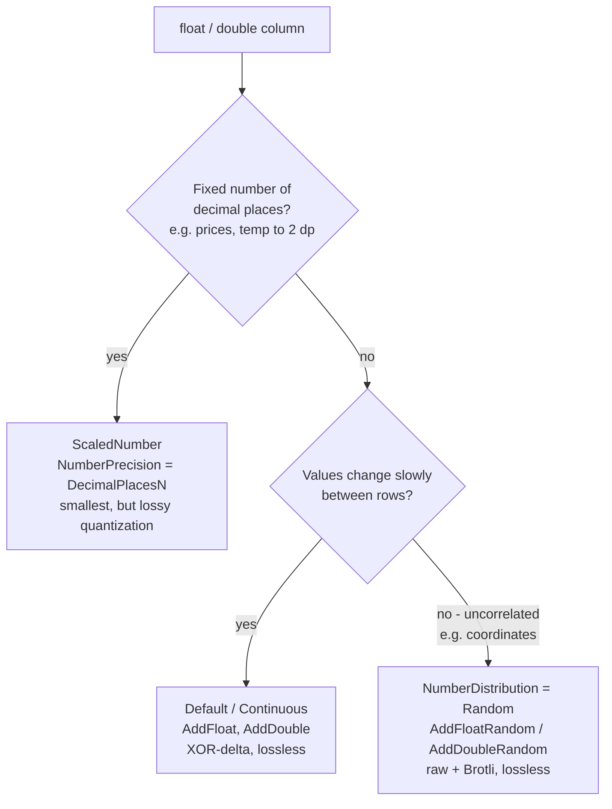

# Getting started

`Easy.TimeSeries` stores tabular, mostly-numeric data column by column and compresses each column with an encoding
chosen for its shape. Picking the right encoding per column is where the size and speed wins come from - and most of
that choice is expressed through a few knobs that are easy to miss. This page is about using those knobs *optimally*.

There are two ways to use the library; they share the same storage format and the same tuning decisions:

- **Low-level** - build a file by hand with `Writer` / `Reader`. Full control, no code generation.
- **Source-generated** - annotate a DTO with `[Column]` and let `Easy.TimeSeries.SrcGen` emit the writer and reader.
  Same knobs, expressed as attribute options. See [Source Generation](source-generation.md) for the generator details.

## Quick start

### Low-level: `Writer` and `Reader`

```csharp
using Easy.TimeSeries;
using Easy.TimeSeries.Storage;

var rows = samples.Count; // at least 2

using var writer = new Writer(rows)
    .AddTimeOrdered(samples.Select(s => s.TimestampUtc), "ts")   // ascending UTC timestamps
    .AddScaledNumber32(samples.Select(s => s.Celsius), "temp", decimalPlaces: 2)
    .AddCategory(samples.Select(s => s.SensorId), "sensor");

using var storage = new FileStorage("readings.ets");
await writer.WriteToAsync(storage);
```

Reading back materializes rows into a DTO. Without code generation, use `ReflectionBasedMaterializer<T>`; the DTO's
`[Column]` indexes must line up with the write order:

```csharp
using var storage = new FileStorage("readings.ets");
var readings = await Reader.ReadFromAsync(storage, new ReflectionBasedMaterializer<Reading>());
```

### Source-generated: annotate a DTO

```csharp
using Easy.TimeSeries.Abstractions;

[GenerateWriter]
[GenerateReader]
public sealed class Reading
{
    [Column(0, Label = "ts", DateTimeSort = DateTimeSort.Ascending)]
    public DateTime TimestampUtc { get; set; }

    [Column(1, Label = "temp", NumberPrecision = NumberPrecision.DecimalPlaces2)]
    public float Celsius { get; set; }

    [Column(2, Label = "sensor")]
    public string SensorId { get; set; } = string.Empty;
}
```

```csharp
using var storage = new FileStorage("readings.ets");
await new ReadingWriter().WriteAsync(samples, storage);
var readings = await new ReadingReader().ReadAsync(new ReadOptions(), storage);
```

The generated `ReadingWriter` issues exactly the `Add…` calls the low-level example wrote by hand - the attribute
options map one-to-one onto them.

## Rules that always apply

- **At least 2 rows.** `new Writer(n)` requires `n >= 2`.
- **Timestamps must be UTC.** `AddTimeOrdered` / `AddTimeUnordered` reject non-UTC input. `DateTime.UtcNow` and friends
  are banned in this repo - take the clock from `TimeProvider.GetUtcNow()`.
- **No nulls.** The format has no null slot; nullable properties (`int?`, `string?`) are rejected by the generator.
- **Column order is physical.** Low-level: the order of `Add…` calls. Source-generated: the `[Column]` index, which must
  start at 0 and be contiguous. The reader matches columns by index, so writer and reader must agree.
- **Lossless vs lossy.** Every encoding is lossless *except* `ScaledNumber32/64`, which quantizes to a fixed number of
  decimal places. That is the only place values can change on the round trip - by design.

## Choosing the encoding per column

### Timestamps (`DateTime`)

Timestamps are the biggest lever. Two decisions:

1. **Sorted or not** - the single most important choice.
   - Ascending (monotonically non-decreasing) timestamps: use **`AddTimeOrdered`** / `DateTimeSort = Ascending`. This
     delta-of-delta encodes them and is dramatically smaller - a regular sampling interval collapses to a few bits per row.
   - Any other order (unsorted, repeated, or values before the epoch): use **`AddTimeUnordered`** / leave
     `DateTimeSort = Unsorted` (the default). Costs at worst ~66 bits per value.
   - When your data is sorted, saying so is free size. When it is not, `AddTimeOrdered` will throw - do not "promise"
     ordering you do not have.

2. **Precision** - pick the coarsest that is still correct: `Milliseconds`, `TenthsOfSecond`, `Seconds`, `Days`, `Years`.
   Coarser precision means smaller deltas and fewer bits. Storing per-day data at `Milliseconds` wastes space.

Epoch constraints to know: the format's epoch is `2000-01-01T00:00:00Z`. `AddTimeOrdered` has a 41-bit ceiling (about
year 2069 at millisecond precision) and cannot represent instants **before** the epoch - such values look "unsorted" and
are rejected. `AddTimeUnordered` has neither limit (it stores a full 64-bit value) and is the escape hatch for
pre-2000 or far-future timestamps.

### Durations (`TimeSpan`)

`AddInterval` / a `TimeSpan` column, tuned only by `TimeSpanPrecision` (`Milliseconds` … `Days`). Same rule: choose the
coarsest precision that preserves your data.

### Real numbers (`float`, `double`)

Three strategies, and the right one depends on how the values behave, not just their type:



- **`ScaledNumber32/64`** (`NumberPrecision = DecimalPlacesN`): when the value is naturally fixed-point - a price to 2
  places, a temperature to 1. It multiplies by `10^N`, rounds to an integer, and delta-encodes that. Usually the smallest
  option, but **lossy**: anything beyond `N` decimals is dropped. Via the attribute, `N` is 1-5; the low-level
  `AddScaledNumber32(..., decimalPlaces)` accepts 1-8.
- **Default (`Continuous`)** - `AddFloat` / `AddDouble`: XOR-delta ("Gorilla") encoding. Lossless, and compact when
  successive values are similar - the normal case for a sampled signal. This is the default when no option is set.
- **`Random`** - `AddFloatRandom` / `AddDoubleRandom` / `NumberDistribution = Random`: for values that are unrelated
  row to row (geographic coordinates, hashes, identifiers). There XOR-delta gives nothing and can even grow past the raw
  width, so the column is stored raw and Brotli-compressed. Lossless. Do **not** use it for slowly-varying signals - plain
  `AddFloat` beats it there.

### Integers (`int`, `long`)

- **Default** - `AddInt32` / `AddInt64`: XOR-delta, ideal for counters, monotonic ids, or slowly-changing values.
- **`Random`** - `AddInt32Random` / `AddInt64Random` / `NumberDistribution = Random`: same story as floats - use it only
  when the integers are uncorrelated between rows (random ids, hashes).

### Categorical text (`string`)

`AddCategory` / a `string` column builds a dictionary (label → small integer id) and stores the id stream. It is the
right choice only for **low-cardinality** columns - a sensor name, a country code, a status enum. Ids 0-15 cost 5 bits,
higher ids 16 bits. Labels are ASCII, max 255 chars, and there is a `short.MaxValue` ceiling on distinct values.
High-cardinality free text (unique messages, GUIDs as strings) is a poor fit - it defeats the dictionary.

### Booleans and exact decimals

- `bool` (`AddBool`) - bit-packed, one bit per value. No tuning.
- `decimal` (`AddDecimal`) - stored exactly (no precision loss). `NumberPrecision` does **not** apply and is ignored if
  set; use `ScaledNumber` on a `float`/`double` when you want fixed-point quantization instead.

## Cheat sheet

| You have …                                        | Writer call            | Attribute option                            |
| ------------------------------------------------- | ---------------------- | ------------------------------------------- |
| Ascending UTC timestamps                          | `AddTimeOrdered`       | `DateTimeSort = Ascending` (+ precision)    |
| Unsorted / pre-2000 / far-future timestamps       | `AddTimeUnordered`     | default `Unsorted` (+ precision)            |
| Durations                                         | `AddInterval`          | `TimeSpanPrecision`                         |
| Fixed-point real number (price, temp)             | `AddScaledNumber32/64` | `NumberPrecision = DecimalPlacesN`          |
| Slowly-varying real signal                        | `AddFloat` / `AddDouble` | default                                   |
| Uncorrelated real values (coords, hashes)         | `AddFloatRandom` / `AddDoubleRandom` | `NumberDistribution = Random` |
| Slowly-varying / monotonic integer                | `AddInt32` / `AddInt64` | default                                    |
| Uncorrelated integers (random ids)                | `AddInt32Random` / `AddInt64Random` | `NumberDistribution = Random`  |
| Low-cardinality text                              | `AddCategory`          | (string column)                             |
| Boolean flag                                      | `AddBool`              | (bool column)                               |
| Exact decimal                                     | `AddDecimal`           | (decimal column)                            |

## Where to next

- [Source Generation](source-generation.md) - the `[Column]` attribute options, the type-mapping table, and the
  `ETS` diagnostics that catch mistakes (e.g. an option set on a column type that ignores it).
- [Data Layout Details](layout.md) - the on-disk byte format and exactly how each encoding packs its column.
