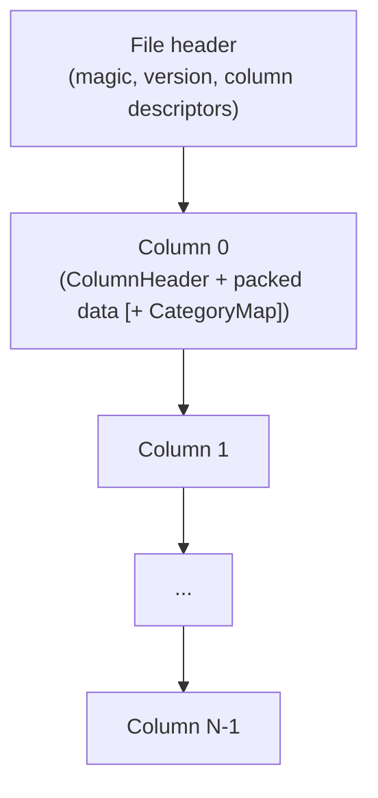
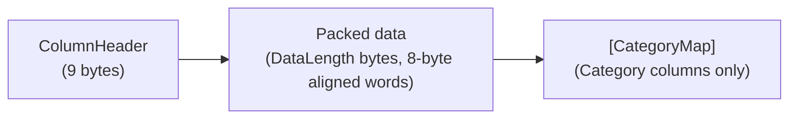

# Data Layout

This document describes the byte-level layout of a serialized time-series file as produced by `Writer` and consumed by `ReadBuilder`. It is meant as a reference for contributors changing the encoding or implementing alternative readers/writers (for example, a source-generated hydrator, or a tool that converts to Parquet).

Authoritative source: the per-type writers and readers in `src/Easy.TimeSeries/Internal/`. When this document and the code disagree, the code wins; fix the document.

All integers on disk are **little-endian**. All bit packing happens inside 64-bit words; words are themselves stored little-endian on disk.

## Top-level file structure

A file is one **file header** followed by N **column blocks** laid out contiguously, in the order columns were added via `Writer.Add*`. The number of columns is declared by the file header (max 255).

There is no overall file footer, no overall checksum, no padding between column blocks.

## File header

Implementation: `Header.WriteTo` and `Header.TryReadFrom` (`src/Easy.TimeSeries/Header.cs`).

| Offset | Size     | Field              | Notes                                            |
| ------ | -------- | ------------------ | ------------------------------------------------ |
| 0      | 1        | Magic byte 1       | Always `0x02` (`Header.H1`).                     |
| 1      | 1        | Magic byte 2       | Always `0xFD` (`Header.H2`).                     |
| 2      | 1        | Version            | `Version` enum byte. Only `V1 = 1` is supported. |
| 3      | 1        | Column count `N`   | Max 255 (`Header.MaxColumns`).                   |
| 4      | variable | Column descriptors | `N` `ColumnInfo` records, concatenated.          |

### Column descriptor (one per column)

| Offset relative | Size         | Field        | Notes                                                                              |
| --------------- | ------------ | ------------ | ---------------------------------------------------------------------------------- |
| 0               | 1            | Value type   | `ColumnValueType` enum byte. See table below.                                      |
| 1               | 4            | Meta (int32) | Type-dependent payload (see "Meta field semantics"). Always 4 bytes little-endian. |
| 5               | 1            | Label length | UTF-8 byte length. `0` means no label.                                             |
| 6               | label length | Label        | UTF-8 bytes. Up to `ColumnInfo.MaxLabelLength = 120` characters.                   |

Value-type byte values (`ColumnValueType`):

| Byte | Name             |
| ---- | ---------------- |
| 0    | `None`           |
| 1    | `DateTimeOrdered` |
| 2    | `TimeSpan`       |
| 3    | `Float`          |
| 4    | `Double`         |
| 5    | `Decimal`        |
| 6    | `Int32`          |
| 7    | `Int64`          |
| 8    | `Bool`           |
| 9    | `ScaledNumber32` |
| 10   | `ScaledNumber64` |
| 11   | `Category`       |
| 12   | `DateTimeUnordered` |
| 13   | `FloatRaw`       |
| 14   | `DoubleRaw`      |
| 15   | `Int64Raw`       |
| 16   | `Int32Raw`       |

### Meta field semantics

| Value type             | `Meta` interpretation                                                                                |
| ---------------------- | ---------------------------------------------------------------------------------------------------- |
| `DateTimeOrdered`, `DateTimeUnordered`, `TimeSpan` | `TimePrecision` enum value (`Milliseconds=0`, `TenthsOfSecond=1`, `Seconds=2`, `Days=3`, `Years=4`). |
| `ScaledNumber32`/`64`  | `decimalPlaces` (1-8). The reader recovers `scale = 10^decimalPlaces`. **Not the scale itself.**     |
| All others             | Unused, written as `0`.                                                                              |

## Column block

Every column block has the same first 9 bytes (the `ColumnHeader`) followed by `DataLength` bytes of packed data. The `Category` column type then appends a `CategoryMap` after the packed data; no other type does.

### Column header (9 bytes)

Implementation: `ColumnHeader.WriteTo` and `ColumnHeader.TryReadFrom` (`src/Easy.TimeSeries/Internal/ColumnHeader.cs`).

| Offset | Size | Field            | Notes                                                                                                           |
| ------ | ---- | ---------------- | --------------------------------------------------------------------------------------------------------------- |
| 0      | 4    | `DataLength`     | uint32 LE. Byte length of the packed data that follows (multiple of 8). Excludes the 9-byte header itself.      |
| 4      | 4    | `Records`        | int32 LE. Number of logical values stored. Must be `>= 1`.                                                      |
| 8      | 1    | `BitsInLastWord` | 0-64. How many bits of the last 8-byte word are actually used. `0` means the last word is fully used (64 bits). |

`TotalBits` is derived: `BitsInLastWord == 0 ? DataLength * 8 : (DataLength - 8) * 8 + BitsInLastWord`.

### Packed-data area

The packed-data area is a sequence of 64-bit little-endian words. Per-type writers push bits into the current word low-to-high via `BitWriter`; when 64 bits are reached the word is flushed to the buffer and a new word starts. The trailing word is padded with zero bits and recorded in `BitsInLastWord`.

`Writer` aligns the start of each column block on a byte boundary (no inter-column bit-stream stitching). Reading must use the per-column reader corresponding to the value type declared in the file header.

The encoding of each value type follows below.

## Per-type encodings

### `Int32` (XOR + block, 32-bit)

Implementation: `Int32Writer` / `Int32Reader`. Used directly by `Int32`, and indirectly by `Float` (via raw `Int32` bits), `ScaledNumber32` (scaled integer), and `TimeSpan` (ticks divided by precision).

Per value, the writer emits:

1. **First value**: 32 bits of the raw value, verbatim. No control bits. `prevBlock` starts as `(leadingZeros=32, trailingZeros=32, blockSize=0)`.
2. **Subsequent values**:
   - Compute `xor = prevValue ^ value`.
   - If `xor == 0`: emit one `0` bit. Value is identical to previous.
   - Else: emit one `1` bit, then:
     - If `xor` fits inside the previous block window (leading and trailing zeros both `>= prevBlock`): emit one `0` bit, then `prevBlock.BlockSize` bits of `xor >> prevBlock.TrailingZeros`.
     - Else: emit one `1` bit, then 4 bits of `leadingZeros`, then 5 bits of `blockSize - 1`, then `blockSize` bits of `xor >> trailingZeros`. The reader recomputes `trailingZeros = 32 - blockSize - leadingZeros`. The new block becomes `prevBlock`.

`blockSize` widths come from `Constants.Size32`: `LeadingZerosLengthBits = 4` (max 15), `BlockSizeLengthBits = 5` (max 32). Negative `Int32` values are stored as a block with `leadingZeros = 0, trailingZeros = 0` (full 32-bit window), see `Block.CreateBlock32`.

### `Int64` (XOR + block, 64-bit)

Same scheme as `Int32`, but with 64-bit values and the wider `Constants.Size64` field widths: 5 bits for `leadingZeros` (max 31), 6 bits for `blockSize - 1` (max 64). The first value is stored in 64 raw bits. Used directly by `Int64`, and indirectly by `Double` (via raw `Int64` bits) and `ScaledNumber64` (scaled integer).

### `Float`

Stored as `BitConverter.SingleToInt32Bits(value)` through an `Int32Writer`. No additional metadata. `Meta = 0`.

### `Double`

Stored as `BitConverter.DoubleToInt64Bits(value)` through an `Int64Writer`. No additional metadata. `Meta = 0`.

### `Decimal` (two interleaved XOR streams)

Implementation: `DecimalWriter` / `DecimalReader`, sharing the XOR + block state machine (`Xor64Writer` / `Xor64Reader`)
with `Int64Writer` / `Int64Reader`. `Meta = 0`.

A `decimal` is 128 bits: a 96-bit unsigned mantissa (`lo`/`mid`/`hi` 32-bit parts from `decimal.GetBits`), a sign bit,
and a scale 0-28. Each value is split into two 64-bit logical words:

| Word       | Content (LSB first)                                                       |
| ---------- | ------------------------------------------------------------------------- |
| `mantissa` | bits 0-63 of the mantissa (`lo \| mid << 32`)                             |
| `meta`     | bits 0-31: `hi`; bits 32-39: scale; bit 40: sign (1 = negative); rest 0   |

Per record the writer emits one `Int64`-style XOR + block frame for `mantissa`, then one for `meta`, in that order,
committed as a single logical entry. Each stream keeps its own XOR state (previous value and previous block); they only
share the bit sequence. The first record therefore costs 128 raw bits.

For typical columns (constant number of decimal places, absolute values below `~1.8e19`) the `meta` word never changes,
so it costs a single `0` bit per record after the first - the column compresses like an `Int64` column plus one bit per
record.

The round-trip is exact, including non-canonical scale: `1.0m` and `1.00m` have different representations (scale 1 vs 2)
and are preserved as written.

### `ScaledNumber32`

`v = (int)Math.Round(value * scale)` where `scale = 10^decimalPlaces`. Then stored through an `Int32Writer`. `Meta = decimalPlaces` (1-8). The reader recovers `value = ((float)((double)v / scale))`. Use this when input is `float` but its meaningful precision is a small, fixed number of decimal places - it compresses dramatically better than raw `Float`.

### `ScaledNumber64`

Same as `ScaledNumber32` with `long` and `Int64Writer`. `Meta = decimalPlaces` (1-8).

### `TimeSpan`

`ticks = value.Ticks / precisionDivisor` (truncating). Stored as an `Int32` through `Int32Writer`. `Meta` is the `TimePrecision` enum value. Range is therefore bounded by `[int.MinValue * divisor, int.MaxValue * divisor]` ticks - `TimeSpanWriter` validates the input.

### `Bool`

One bit per value, packed low-to-high inside each 64-bit word. No control bits, no compression. `BoolReader` reads exactly `ColumnHeader.Records` bits. `Meta = 0`.

### `DateTimeOrdered` (delta-of-delta)

Implementation: `DateTimeOrderedWriter` / `DateTimeOrderedReader`. `Meta` is the `TimePrecision`.

Every input must be UTC and monotonically non-decreasing (the writer throws otherwise). The timestamp is normalized to `(dt.Ticks - Epoch.Ticks) / precisionDivisor` where `Epoch = 2000-01-01T00:00:00Z`. At millisecond precision this stays within 41 bits until `2069-09-06T15:47:35.551Z` (`Constants.TimeStamp.MaxBits = 41`).

Per value, the writer emits:

1. **First value**: 41 bits of the normalized timestamp, verbatim. `prevDelta` is initialized to `1`.
2. **Subsequent values**:
   - `delta = ts - prevTs`, `dod = delta - prevDelta`.
   - If `dod == 0`: emit one `0` bit. `prevTs = ts`. (`prevDelta` unchanged.)
   - Else: emit one `1` bit, then a 2-bit prefix selecting one of four bucket widths, then `dod + bias` in the bucket width. `prevTs = ts`, `prevDelta = delta`.

Bucket table (from `Constants.TimeStamp`):

| Prefix (2 bits) | Encoded bits | `                         | dod | <` |
| --------------- | ------------ | ------------------------- |
| `00`            | 3            | 4 (`2^(3-1)`)             |
| `01`            | 7            | 64 (`2^(7-1)`)            |
| `10`            | 12           | 2048 (`2^(12-1)`)         |
| `11`            | 32           | otherwise (32-bit signed) |

The bias added before writing equals the bucket's `2^(bits-1)` (so the on-disk value is unsigned). The reader subtracts the same bias.

### `DateTimeUnordered` (absolute timestamp, XOR)

Implementation: `DateTimeUnorderedWriter` / `DateTimeUnorderedReader`. `Meta` is the `TimePrecision`.

For `DateTime` columns whose values are **not** sorted. Every input must be UTC, but there is no ordering constraint:
values may appear in any order, repeat, or even precede the epoch (the timestamp is then negative). The timestamp is
normalized exactly as for `DateTimeOrdered` - `(dt.Ticks - Epoch.Ticks) / precisionDivisor` - but stored as a full 64-bit
value through the same XOR + block state machine used by `Int64` (`Xor64Writer`/`Xor64Reader`), so neither the 41-bit
ceiling nor the monotonicity requirement of the delta-of-delta encoding applies.

Prefer `DateTimeOrdered` when the column is monotonically non-decreasing - delta-of-delta compresses it
considerably better. `DateTimeUnordered` costs at worst ~66 bits per value (vs. 64 raw), and much less when
neighboring values share high bits, which is typical for event times clustered in a window.

### `Category` (dictionary, variable-width id)

Implementation: `CategoryWriter` / `CategoryReader`, with `CategoryMap` and `IdAccumulator`.

`Writer.AddCategory` first builds a `CategoryMap` (label -> short id, contiguous starting at 0) using an `IdAccumulator`. The packed-data area stores the id sequence; the dictionary is appended **after** the packed data.

Per id, the writer emits one of two variable-width frames:

| Id range | Frame bits | Layout (LSB first)           |
| -------- | ---------- | ---------------------------- |
| `0..15`  | 5          | `0` (prefix) + 4 bits of id  |
| `16..n`  | 16         | `1` (prefix) + 15 bits of id |

The reader peeks the prefix bit then reads either 4 or 15 bits for the id, and looks up the label in the `CategoryMap`.

#### `CategoryMap` (appended after the packed data)

| Offset relative | Size     | Field                | Notes                                                                   |
| --------------- | -------- | -------------------- | ----------------------------------------------------------------------- |
| 0               | 2        | `totalSize` (uint16) | Byte length of the rest of the map (excludes these 2 size bytes).       |
| 2               | 2        | `count` (int16)      | Number of label entries (must be `> 0`, max `short.MaxValue`).          |
| 4               | variable | Labels               | `count` entries: 1 byte length + ASCII bytes (max 255 chars per label). |

Labels are written in id-sorted order, so the i-th entry has id `i`. The reader recovers the id-to-label mapping by counting.

The reader finds the map by reading the column header's `DataLength` and jumping past `ColumnHeader.Size + DataLength` from the start of the column block (see `CategoryReader.ReadCategoryMap`). `Header.ReadLayout` calls `ColumnHeader.GetTotalLength(buffer, ColumnValueType.Category)` to include the map length when computing column offsets - this is the **only** case where the column block extends past `ColumnHeader.Size + DataLength`.

### `FloatRaw` / `DoubleRaw` / `Int64Raw` / `Int32Raw` (raw values, Brotli-compressed)

Implementation: `RawColumn` (shared codec), driven by `Writer.AddFloatRandom` / `AddDoubleRandom` /
`AddInt64Random` / `AddInt32Random` on the write side and `Reader.ColumnRaw<T, TValue>` on the read side.
`Meta` is unused (`0`).

For numeric columns whose values are **uncorrelated between rows** (e.g. geographic coordinates, identifiers), the
XOR/delta ("Gorilla") encoding used by `Float`/`Double`/`Int64`/`Int32` gives no benefit and can even exceed the raw
32/64-bit width because of its per-value control bits. These column types skip that encoding entirely: the values are
laid out as their raw little-endian bytes (`sizeof(T) * Records` bytes) and the whole block is Brotli-compressed.

The packed-data area is therefore the Brotli image of the raw value bytes. `ColumnHeader.DataLength` is the compressed
byte length, `ColumnHeader.Records` is the value count, and `BitsInLastWord` is `0` (the payload is not word-packed).
Brotli parameters are fixed in `Constants.Brotli` (quality 9, window 22). Decoding decompresses straight into a
`Records`-length value buffer, so the reader knows the exact output size up front.

The transform is lossless and bit-preserving. Prefer the plain `Float`/`Double`/`Int64` types for slowly-varying
signals - XOR/delta compresses those far better than Brotli-over-raw would.

## Worked example: one `Int32` column with one value

Suppose `Writer.AddInt32([42], "x").WriteToAsync(...)`. The resulting bytes are:

| Offset | Bytes (hex)               | Meaning                                                       |
| ------ | ------------------------- | ------------------------------------------------------------- |
| 0      | `02 FD`                   | Magic.                                                        |
| 2      | `01`                      | Version V1.                                                   |
| 3      | `01`                      | One column.                                                   |
| 4      | `06`                      | ColumnValueType.Int32.                                        |
| 5      | `00 00 00 00`             | Meta = 0.                                                     |
| 9      | `01`                      | Label length = 1.                                             |
| 10     | `78`                      | Label `"x"`.                                                  |
| 11     | `08 00 00 00`             | ColumnHeader: DataLength = 8.                                 |
| 15     | `01 00 00 00`             | ColumnHeader: Records = 1.                                    |
| 19     | `20`                      | ColumnHeader: BitsInLastWord = 32 (the 32-bit first value).   |
| 20     | `2A 00 00 00 00 00 00 00` | One 8-byte word: `42` in the low 32 bits, zero padding above. |

Total: 28 bytes. (Adjust the label and meta bytes for other columns.)

## Invariants worth remembering when changing the format

- A logical entry is a **single call** to a per-type writer. The per-type writer is responsible for calling `BitWriter.CommitRecord()` exactly once per entry, even when the underlying `Write` emits multiple bit groups. Forgetting this makes `ColumnHeader.Records` wrong and breaks the reader.
- `BitWriter.Flush()` is the only call site that writes the column header; `Writer.CreateWriters` reserves the first 9 bytes of each column buffer for that header.
- `DataLength` is in **bytes** and is always a multiple of 8. `TotalBits` and `Records` are independent counts; do not multiply `DataLength` by 8 to get either of them.
- For `Category`, the map size lives in the first 2 bytes of the map area (`uint16`). `Header.ReadLayout` and `CategoryReader.ReadCategoryMap` both rely on this to advance past the column.
- For `ScaledNumber*`, `ColumnInfo.Meta` is `decimalPlaces`, not `scale`. Both the writer and the reader must compute `scale = 10^decimalPlaces`.
- `ScaledNumber32` uses `int` and `Math.Round`; the absolute value of `value * 10^decimalPlaces` must fit in `int.MaxValue` (`~2.1e9`). Use `ScaledNumber64` if it does not.
- `DateTimeOrdered` requires `DateTimeKind.Utc` and monotonically non-decreasing timestamps. The 41-bit ceiling at millisecond precision is `Epoch + 2^41 - 1` ms ≈ `2069-09-06T15:47:35.551Z`.
- The `DateTimeOrdered` writer (delta-of-delta) is for time-series-ordered columns only. DTO collections that happen to carry
  arbitrary `DateTime` properties (e.g. a birth date) violate the monotonic-UTC constraint and will throw at write
  time - use `DateTimeUnordered` (`Writer.AddTimeUnordered`) for those. Selection between the two writers will be
  codified by the source generator via `ColumnAttribute.DateTimeSort`.
