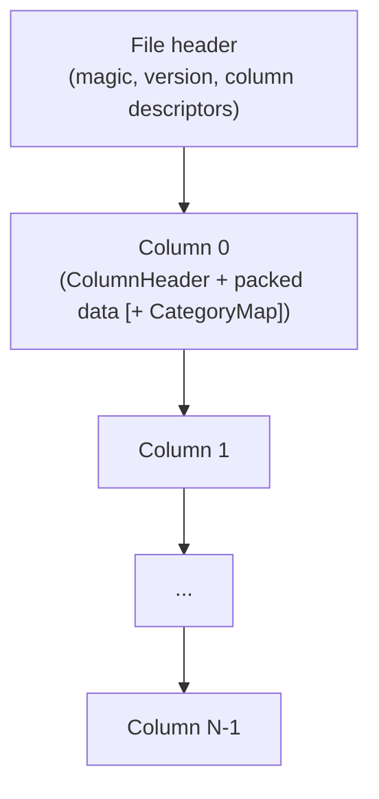
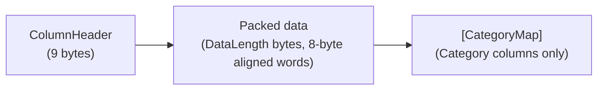

# Data Layout

This document explains the on-disk format of a serialized time-series file: how it is structured and why each column
type is encoded the way it is. It is a conceptual reference for contributors and for anyone implementing an alternative
reader or writer (for example a Parquet converter). It deliberately stops short of the exact bit-level arithmetic - the
per-type writers and readers in `src/Easy.TimeSeries/Internal/` are the authoritative source for that. When this
document and the code disagree, the code wins; fix the document.

For guidance on *which* encoding to choose for your data, see [Introduction](introduction.md). This document is about
the format, not about how to use it optimally.

All integers on disk are **little-endian**. Bit-packed columns pack values into 64-bit words, themselves stored
little-endian.

## Top-level file structure

A file is one **file header** followed by N **column blocks** laid out contiguously, in the order columns were added via
`Writer.Add*`. The header declares how many columns follow (max 255). There is no file footer, no overall checksum, and
no padding between blocks - the header alone is enough to locate and decode every column.

## File header

Implementation: `Header.WriteTo` and `Header.TryReadFrom` (`src/Easy.TimeSeries/Header.cs`).

The header is a small, self-describing table of contents: two magic bytes and a version so a reader can reject buffers
it does not understand, a column count, and one descriptor per column.

| Offset | Size     | Field              | Notes                                            |
| ------ | -------- | ------------------ | ------------------------------------------------ |
| 0      | 1        | Magic byte 1       | Always `0x02` (`Header.H1`).                     |
| 1      | 1        | Magic byte 2       | Always `0xFD` (`Header.H2`).                     |
| 2      | 1        | Version            | `Version` enum byte. Only `V1 = 1` is supported. |
| 3      | 1        | Column count `N`   | Max 255 (`Header.MaxColumns`).                   |
| 4      | variable | Column descriptors | `N` `ColumnInfo` records, concatenated.          |

### Column descriptor (one per column)

Each descriptor names the column's encoding, carries an encoding-specific `Meta` value, and an optional label.

| Offset relative | Size         | Field        | Notes                                                                              |
| --------------- | ------------ | ------------ | ---------------------------------------------------------------------------------- |
| 0               | 1            | Value type   | `ColumnValueType` enum byte. See table below.                                      |
| 1               | 4            | Meta (int32) | Type-dependent payload (see "Meta field semantics"). Always 4 bytes little-endian. |
| 5               | 1            | Label length | UTF-8 byte length. `0` means no label.                                             |
| 6               | label length | Label        | UTF-8 bytes. Up to `ColumnInfo.MaxLabelLength = 120` characters.                   |

Value-type byte values (`ColumnValueType`):

| Byte | Name             |
| ---- | ---------------- |
| 0    | `None`           |
| 1    | `DateTimeOrdered` |
| 2    | `TimeSpan`       |
| 3    | `Float`          |
| 4    | `Double`         |
| 5    | `Decimal`        |
| 6    | `Int32`          |
| 7    | `Int64`          |
| 8    | `Bool`           |
| 9    | `ScaledNumber32` |
| 10   | `ScaledNumber64` |
| 11   | `Category`       |
| 12   | `DateTimeUnordered` |
| 13   | `FloatRaw`       |
| 14   | `DoubleRaw`      |
| 15   | `Int64Raw`       |
| 16   | `Int32Raw`       |

### Meta field semantics

`Meta` is a 4-byte scratch field whose meaning depends on the value type.

| Value type             | `Meta` interpretation                                                                                |
| ---------------------- | ---------------------------------------------------------------------------------------------------- |
| `DateTimeOrdered`, `DateTimeUnordered`, `TimeSpan` | `TimePrecision` enum value (`Milliseconds=0`, `TenthsOfSecond=1`, `Seconds=2`, `Days=3`, `Years=4`). |
| `ScaledNumber32`/`64`  | `decimalPlaces` (1-8). The reader recovers `scale = 10^decimalPlaces`. **Not the scale itself.**     |
| All others             | Unused, written as `0`.                                                                              |

## Column block

Every column block starts with a fixed 9-byte `ColumnHeader` followed by `DataLength` bytes of packed data. Only the
`Category` type appends anything more (its dictionary map).

### Column header (9 bytes)

Implementation: `ColumnHeader.WriteTo` and `ColumnHeader.TryReadFrom` (`src/Easy.TimeSeries/Internal/ColumnHeader.cs`).

These three fields let a reader find the end of the block, know how many values to decode, and know how much of the
final word is meaningful.

| Offset | Size | Field            | Notes                                                                                                           |
| ------ | ---- | ---------------- | --------------------------------------------------------------------------------------------------------------- |
| 0      | 4    | `DataLength`     | uint32 LE. Byte length of the packed data that follows (multiple of 8). Excludes the 9-byte header itself.      |
| 4      | 4    | `Records`        | int32 LE. Number of logical values stored. Must be `>= 1`.                                                      |
| 8      | 1    | `BitsInLastWord` | 0-64. How many bits of the last 8-byte word are actually used. `0` means the last word is fully used (64 bits). |

`DataLength` counts bytes, `Records` counts values; they are independent. `TotalBits` is derived from `DataLength` and
`BitsInLastWord`, not from `Records`.

### Packed-data area

For bit-packed columns the packed data is a sequence of 64-bit little-endian words. Per-type writers push bits into the
current word low-to-high; when it fills, the word is flushed and a new one starts. The trailing word is zero-padded and
its used-bit count recorded in `BitsInLastWord`. Each column block starts on a byte boundary - there is no bit-stream
stitching between columns, so a column can only be decoded with the reader matching its declared value type.

The raw+Brotli column types are the exception: their packed data is a compressed byte image, not word-packed bits (see
below).

## Per-type encodings

The encodings fall into three families: **XOR/delta** for numbers that vary slowly, **quantized/dictionary** transforms
that shrink the data before storing it, and **raw+Brotli** for values with no exploitable structure. What follows is the
intent of each; consult the `Internal/` writer/reader pair for the exact bit mechanics.

### Integers - `Int32` and `Int64` (XOR + block)

Implementation: `Int32Writer`/`Int32Reader`, `Int64Writer`/`Int64Reader`.

The first value is stored verbatim (32 or 64 bits). Each subsequent value is stored as its XOR against the previous one:
identical values cost a single bit, and values that differ only in a narrow range of bits store just that range plus a
small descriptor of where it sits. This is compact when neighboring values are similar and degrades toward the raw width
when they are not. `Int32` also underpins `Float`, `ScaledNumber32`, and `TimeSpan`; `Int64` underpins `Double` and
`ScaledNumber64`.

### `Float` and `Double`

Reinterpreted to their raw integer bits (`float`→`int`, `double`→`long`) and stored through the corresponding integer
encoder. Lossless. Because the XOR scheme keys off similar bit patterns, this compresses well only for slowly-varying
signals; uncorrelated values are better served by `FloatRaw`/`DoubleRaw`.

### `Decimal`

Implementation: `DecimalWriter`/`DecimalReader`, sharing the XOR state machine with `Int64`.

A `decimal` is split into two 64-bit words - the low mantissa bits, and a second word holding the remaining mantissa
bits, the scale, and the sign - each carried through an independent `Int64`-style XOR stream. The round-trip is exact,
including non-canonical scale (`1.0m` and `1.00m` are preserved distinctly). For typical columns the second word never
changes and costs about one bit per row, so the column compresses much like an `Int64` column.

### `ScaledNumber32` and `ScaledNumber64` (lossy)

A floating value is multiplied by `10^decimalPlaces`, rounded to an integer, and stored through the matching integer
encoder; `Meta` holds `decimalPlaces`. This trades precision for size and compresses dramatically better than raw floats
when the meaningful precision is a small, fixed number of decimals. `ScaledNumber32` requires the scaled value to fit in
`int`; use `ScaledNumber64` otherwise.

### `TimeSpan`

The interval's ticks are divided by the precision divisor (truncating) and stored as an `Int32`. `Meta` holds the
`TimePrecision`. The range is bounded by what fits in `int` at the chosen precision, which the writer validates.

### `Bool`

One bit per value, packed low-to-high, no compression. The reader consumes exactly `Records` bits.

### `DateTimeOrdered` (delta-of-delta)

Implementation: `DateTimeOrderedWriter`/`DateTimeOrderedReader`. `Meta` holds the `TimePrecision`.

The intended encoding for time-series timestamps. Inputs must be UTC and monotonically non-decreasing (the writer throws
otherwise). Timestamps are normalized against a fixed epoch of `2000-01-01T00:00:00Z` at the chosen precision, then
stored as the *change in the interval between consecutive values* (delta-of-delta). Regularly-sampled series - the
common case - have a near-constant interval, so most values cost a single bit; irregular gaps fall back to progressively
wider fixed-width buckets. At millisecond precision the normalized timestamp is capped at 41 bits, reaching roughly
`2069-09-06T15:47:35Z`; a value past that ceiling is rejected rather than truncated.

Each non-zero delta-of-delta is written as a 2-bit bucket prefix followed by a fixed-width signed payload:

| Prefix | Payload bits | Holds delta-of-delta        |
| ------ | ------------ | --------------------------- |
| `00`   | 3            | +/-2^2                      |
| `01`   | 7            | +/-2^6                      |
| `10`   | 12           | +/-2^11                     |
| `11`   | 42           | anything else, up to +/-2^41 |

The widest bucket is the catch-all, so it has to cover the worst case outright: with timestamps spanning
`[0, 2^41-1]`, a delta-of-delta lands in `[-(2^41-1), 2^41-1]`, which needs 42 signed bits. It was 32 bits, which
silently truncated any gap whose delta-of-delta passed +/-2^31 - about 24.9 days at millisecond precision. Only
values that actually reach this bucket pay the extra 10 bits, and regular sampling rarely does.

### `DateTimeUnordered` (absolute, XOR)

Implementation: `DateTimeUnorderedWriter`/`DateTimeUnorderedReader`. `Meta` holds the `TimePrecision`.

For `DateTime` columns that are **not** sorted - values in any order, repeats, or timestamps before the epoch (stored as
negative). Timestamps are normalized against the same epoch but stored as full 64-bit absolute values through the
`Int64` XOR state machine, so neither the 41-bit ceiling nor the ordering constraint applies. It costs at worst slightly
more than the raw 64 bits, and less when neighboring values share high bits (typical for event times in a window).
Prefer `DateTimeOrdered` whenever the column is sorted - it compresses far better.

### `Category` (dictionary)

Implementation: `CategoryWriter`/`CategoryReader`, with `CategoryMap` and `IdAccumulator`.

Strings are mapped to small contiguous integer ids; the packed data stores the id sequence (narrow ids cost fewer bits
than wide ones), and the id-to-label dictionary is appended **after** the packed data. This is the one column type whose
block extends past `ColumnHeader.Size + DataLength`, so `Header.ReadLayout` asks `ColumnHeader.GetTotalLength` to include
the map when computing column offsets. Ideal for low-cardinality repeated text; poorly suited to high-cardinality free
text.

The appended `CategoryMap` begins with its own byte length, then an entry count, then the labels in id order (each a
length-prefixed string), so a reader recovers the id→label mapping by position. See `CategoryReader.ReadCategoryMap` for
the exact byte offsets.

### `FloatRaw` / `DoubleRaw` / `Int64Raw` / `Int32Raw` (raw values, Brotli-compressed)

Implementation: `Util.BrotliCompress`/`BrotliDecompress`, driven by `Writer.AddFloatRandom` / `AddDoubleRandom` /
`AddInt64Random` / `AddInt32Random` and `Reader.ColumnRaw<T, TValue>`. `Meta` is unused.

For numeric columns whose values are **uncorrelated between rows** (geographic coordinates, identifiers, and similar),
the XOR/delta scheme gives no benefit and its per-value control bits can even exceed the raw width. These types skip it
entirely: the values are laid out as their raw little-endian bytes and the whole block is Brotli-compressed. The
transform is lossless and bit-preserving.

For these blocks `DataLength` is the *compressed* byte length, `Records` is the value count, and `BitsInLastWord` is `0`
(the payload is not word-packed). Because `Records` gives the exact decompressed size up front, the reader decompresses
straight into a value buffer. Prefer the plain `Float`/`Double`/`Int64`/`Int32` types for slowly-varying signals -
XOR/delta beats Brotli-over-raw there.

## Invariants worth remembering when changing the format

- A logical entry is a **single call** to a per-type writer. The writer must call `BitWriter.CommitRecord()` exactly once
  per entry even when it emits several bit groups; miscounting breaks `ColumnHeader.Records` and the reader.
- `BitWriter.Flush()` is the only place the column header is written; `Writer.CreateWriters` reserves the first 9 bytes of
  each column buffer for it.
- `DataLength` is in **bytes** (a multiple of 8 for bit-packed columns); `Records` is a value count. They are independent -
  do not derive one from the other.
- For `ScaledNumber*`, `Meta` is `decimalPlaces`, not the scale. Both sides compute `scale = 10^decimalPlaces`.
- `DateTimeOrdered` requires UTC, monotonically non-decreasing input and is capped near `2069-09-06` at millisecond
  precision. Arbitrary `DateTime` properties (e.g. a birth date) belong in `DateTimeUnordered`.
- Only `Category` extends its block past `ColumnHeader.Size + DataLength`; `Header.ReadLayout` relies on this when walking
  columns.
