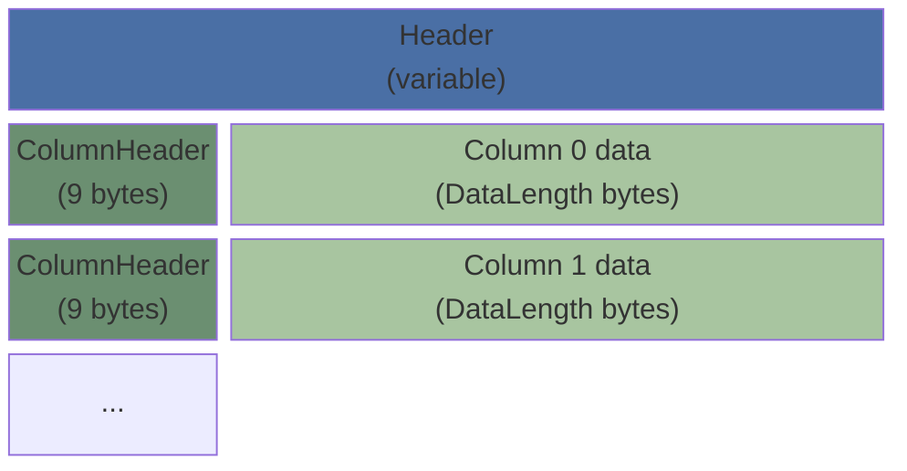
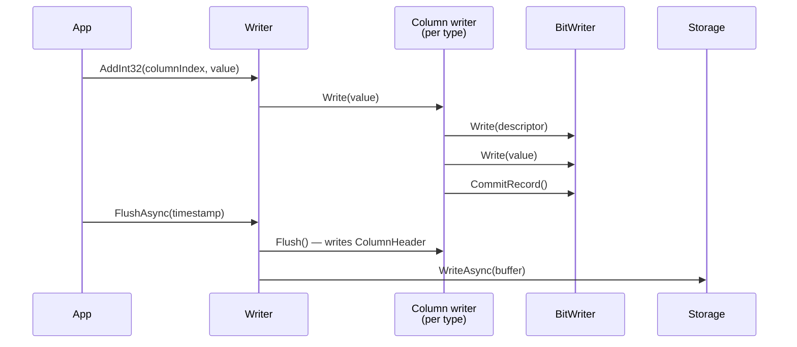
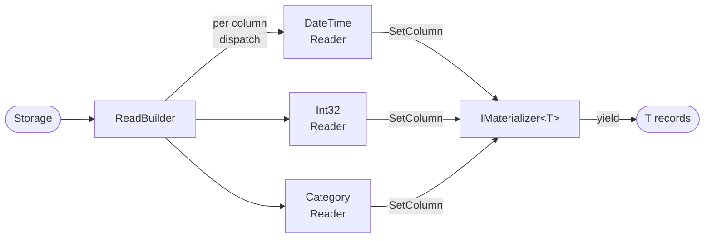
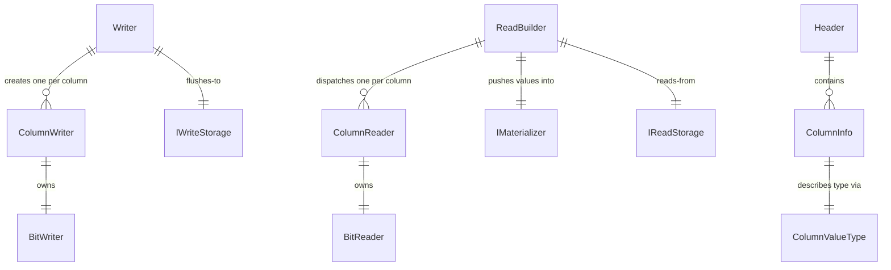
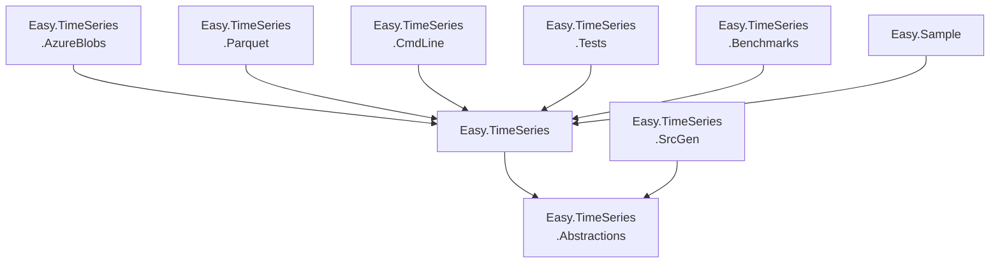

# Markdown Examples

Reference page for formatting and visualization features available in this mdbook.
Plugins installed: `mdbook-toc`, `mdbook-mermaid`.

<!-- toc -->

---

## Text Formatting

**Bold**, *italic*, ***bold italic***, ~~strikethrough~~, `inline code`.

> Blockquote text. Can span multiple lines.
> Second line of the blockquote.
>
> > Nested blockquote.

Superscript via HTML: 10<sup>6</sup> records. Subscript: H<sub>2</sub>O.

---

## Lists

Unordered:

- Alpha
- Bravo
  - Charlie
  - Delta
    - Echo
- Foxtrot

Ordered:

1. First step
2. Second step
   1. Sub-step A
   2. Sub-step B
3. Third step

Task list:

- [x] Write format examples
- [x] Add mermaid diagrams
- [ ] Publish to GitHub Pages

---

## Code

Inline: call `ReadBuilder.Build<T>()` to materialize records.

Fenced block with syntax highlighting:

```csharp
public sealed class PowerPlant
{
    [Column(0)] public DateTime Timestamp { get; set; }
    [Column(1)] public float OutputMw { get; set; }
    [Column(2, decimalPlaces: 2)] public decimal Price { get; set; }
    [Column(3)] public string? Zone { get; set; }
}
```

Shell:

```bash
dotnet test tests/Easy.TimeSeries.Tests/ -c Release --nologo
```

---

## Tables

| Column type       | Writer method     | Reader method       | Notes                        |
|-------------------|-------------------|---------------------|------------------------------|
| `DateTime`        | `AddTime`         | `ReadTime`          | Epoch 2000-01-01, 41-bit cap |
| `int`             | `AddInt32`        | `ReadInt32`         |                              |
| `long`            | `AddInt64`        | `ReadInt64`         |                              |
| `float`           | `AddFloat`        | `ReadFloat`         |                              |
| `double`          | `AddDouble`       | `ReadDouble`        |                              |
| `decimal`         | `AddScaled32`     | `ReadScaled32`      | `decimalPlaces` in meta      |
| `bool`            | `AddBool`         | `ReadBool`          |                              |
| `string`          | `AddCategory`     | `ReadCategory`      | Dictionary-encoded           |

## Diagrams (`mdbook-mermaid`)

### File format — block structure



### Write pipeline — sequence



### Read pipeline — flowchart



### ER — key types



### Project dependencies



## Links and References

- [mdbook documentation](https://rust-lang.github.io/mdBook/)
- [mdbook-mermaid](https://github.com/badboy/mdbook-mermaid)
- [mdbook-toc](https://github.com/badboy/mdbook-toc)

Internal cross-references: [Layout details](layout.md), [Code style](code-style.md).
